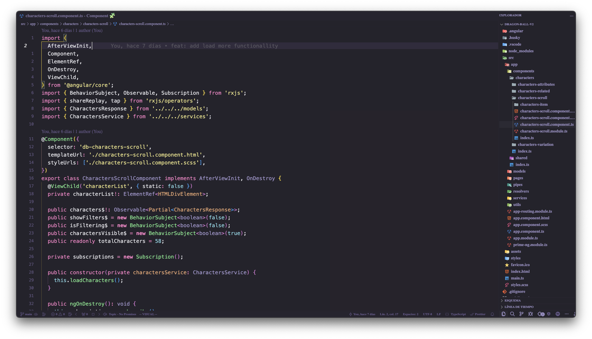
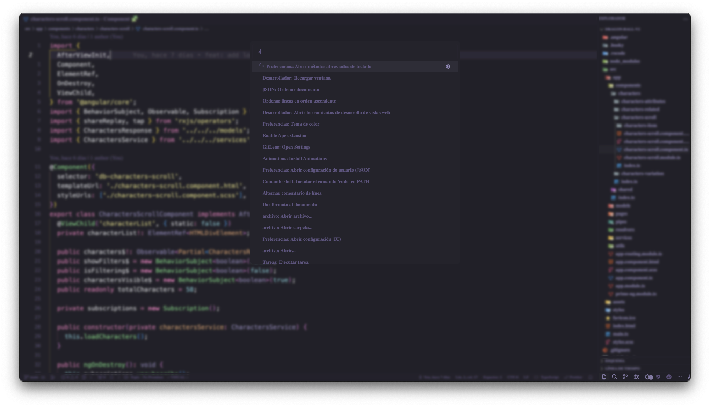
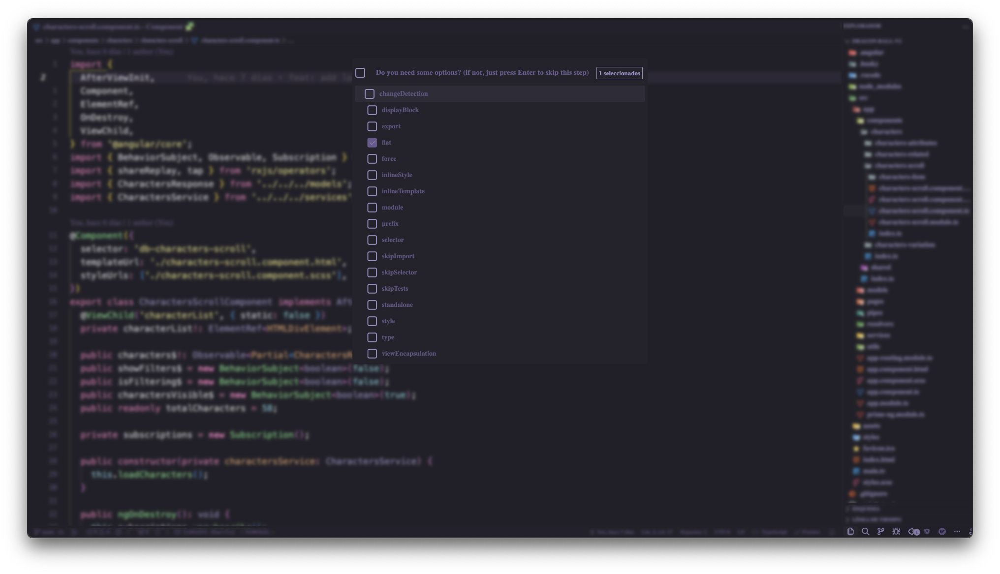
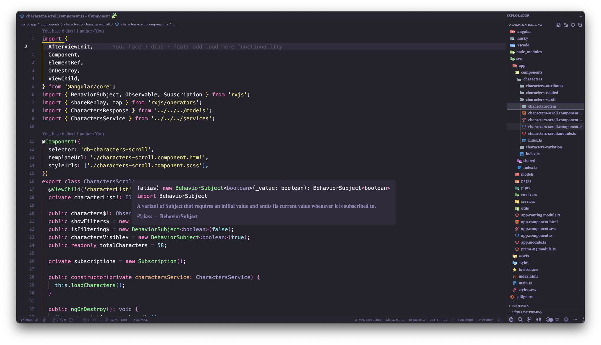

# VSCode Custom Config

A custom configuration for vscode built using APC Customize UI++ and pure css
This config is built using the [Ommi Owl](https://marketplace.visualstudio.com/items?itemName=guilhermerodz.omni-owl) theme as base, colors are chosen based on theme colors, but feel free to change whatever you need






# Install

Just copy the content of `scripts` in any folder and replace (or append) your `settings.json` with this one and update the scripts path in `settings.json` file

```json
"apc.imports": [
    "file://${userHome}/.vscode/extensions/brandonkirbyson.vscode-animations-2.0.3/dist/updateHandler.js",
    "file://${userHome}/.vscode/scripts/quick-input/quick-input-blur.css",
    "file://${userHome}/.vscode/scripts/quick-input/quick-input-blur.js",
    "file://${userHome}/.vscode/scripts/quick-input/quick-input.js",
    "file://${userHome}/.vscode/scripts/base/base.css",
    "file://${userHome}/.vscode/scripts/base/checkbox.css",
    "file://${userHome}/.vscode/scripts/search/search.css",
    "file://${userHome}/.vscode/scripts/suggestions/suggestions.css"
]
```

## Important

- Make sure that you've installed and configured the [APC Customize UI++](https://marketplace.visualstudio.com/items?itemName=drcika.apc-extension) extension
- If you want cool animations make sure to install [VSCode Animations](https://marketplace.visualstudio.com/items?itemName=BrandonKirbyson.vscode-animations) extension
